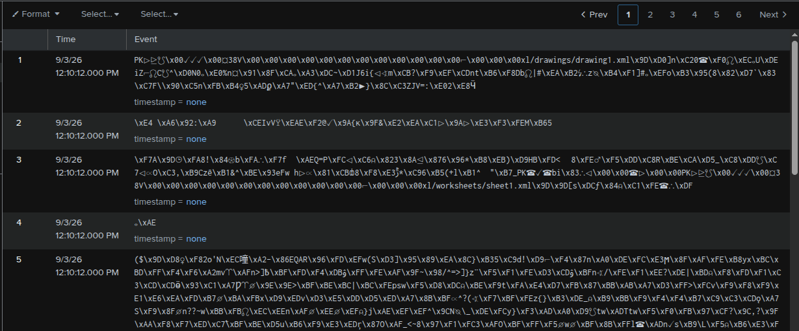
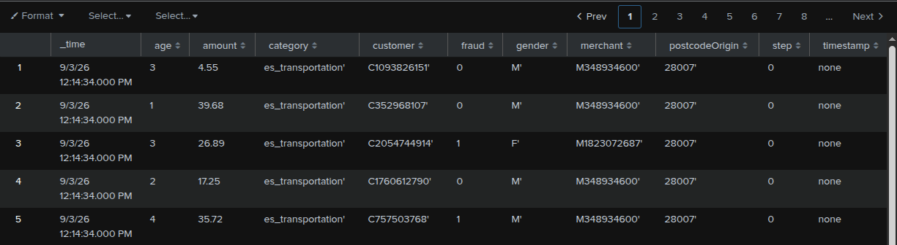
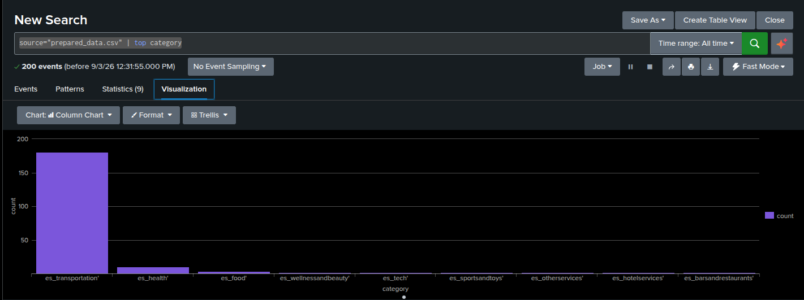
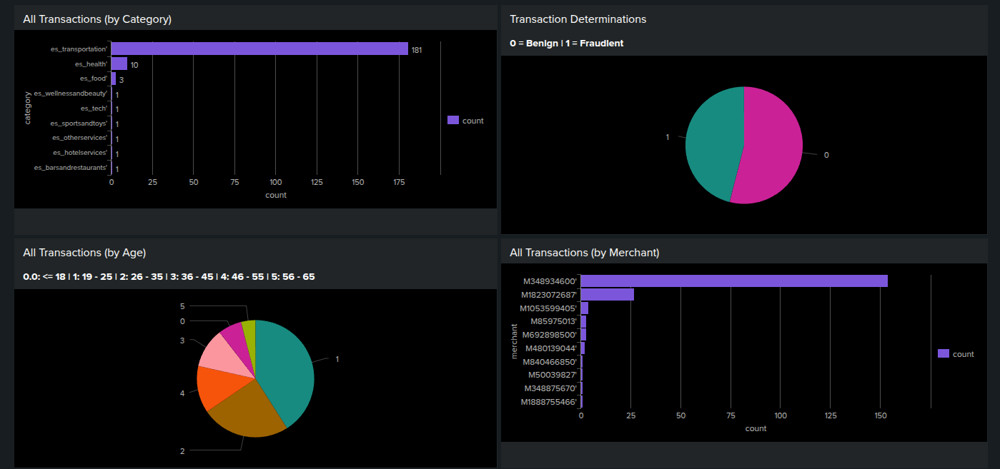
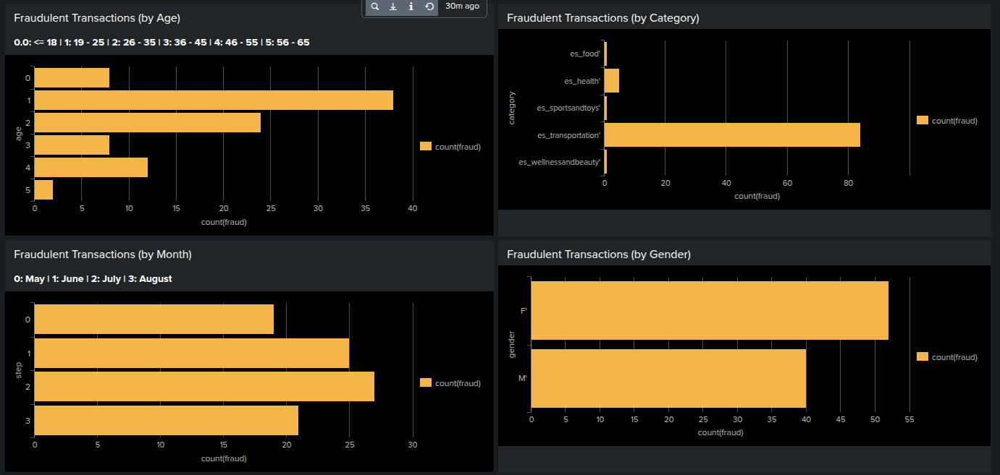
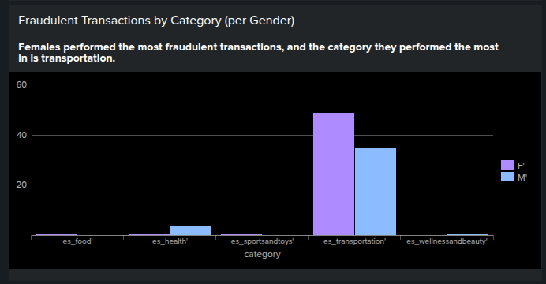
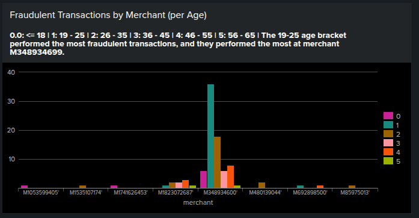

## 1. Data Analysis with Splunk

The goal is to use Splunk to create dashboards and visualization for banking transactions to monitor fraud. To do so, I needed to install the enterprise version of Splunk on my local host, upload the data, and then run queries and create visualizations to answer specific questions.

### 1.1. Installing Splunk

The lab instructions only had instructions for installation for Windows, so I needed to figure this out on my own. Once I made a Splunk account, I was able to access the download binaries, where they were kind enough to have pre-made wget commands. As I'm running Mint, which is based on Ubuntu, which is based on Debian, I need the .deb file.

`wget -O splunk-10.4.3-4174a2deda5d-linux-amd64.deb "https://download.splunk.com/products/splunk/releases/10.4.3/linux/splunk-10.4.3-4174a2deda5d-linux-amd64.deb"`

After that, I needed to install the package:

`sudo dpkg -i splunk-10.4.2-33c3bf42cd73-linux-amd64.deb`

Then it was a matter of `cd`-ing into the `opt/splunk` directory and running `./splunk start`. Once the script finishes running, I'm given an http address where I can log into Splunk and start working.

### 1.2. Importing Data

This took a bit of clean-up in order to work correctly. The lab supplied a document named `Prepared_data.csv`, but what downloads is `prepared_data.xlsx`. Opening it in a spreadsheet program (SoftMaker PlanMaker 2024, though any would get the job done) shows the expected data:

| step | customer     | age | gender | postcodeOrigin | merchant     | category           | amount | fraud |
| ---- | ------------ | --- | ------ | -------------- | ------------ | ------------------ | ------ | ----- |
| 0    | C1093826151' | 3   | M'     | 28007'         | M348934600'  | es_transportation' | 4.55   | 0     |
| 0    | C352968107'  | 1   | M'     | 28007'         | M348934600'  | es_transportation' | 39.68  | 0     |
| 0    | C2054744914' | 3   | F'     | 28007'         | M1823072687' | es_transportation' | 26.89  | 1     |
| 0    | C1760612790' | 2   | M'     | 28007'         | M348934600'  | es_transportation' | 17.25  | 0     |
| 0    | C757503768'  | 4   | M'     | 28007'         | M348934600'  | es_transportation' | 35.72  | 1     |

Adding the spreadsheet to Splunk does not yield the expected results:



By saving the workbook as a .csv, this puts the data in a format that Splunk can work with:

    step,customer,age,gender,postcodeOrigin,merchant,category,amount,fraud
    0,C1093826151',3,M',28007',M348934600',es_transportation',4.55,0
    0,C352968107',1,M',28007',M348934600',es_transportation',39.68,0
    0,C2054744914',3,F',28007',M1823072687',es_transportation',26.89,1
    0,C1760612790',2,M',28007',M348934600',es_transportation',17.25,0
    0,C757503768',4,M',28007',M348934600',es_transportation',35.72,1



Now we can move onto the data analysis.

### 1.3. Dashboard Creation

I have a lot of experience creating reports--including charts--with Microsoft Excel and making interactive dashboards with Google Looker, so it was simply a matter of learning how Splunk formats their queries and hooks them up into the charts.

The lab offers this query to start (although I had to change the source for my specific file):

`source="prepared_data.csv" | top category`

Which returns:

| [category](-)[](-) | [count](-)[](-) | [percent](-)[](-) |
| ------------------------------------------------------------------------------------------------------------------------------------------------------------------------------------------------------------------------------------------------------------------------------------------------------------------------------------------------------------------------------------------------------------------------------------------------------------------------------------------------------------------------------------------------------------------------------ | --------------------------------------------------------------------------------------------------------------------------------------------------------------------------------------------------------------------------------------------------------------------------------------------------------------------------------------------------------------------------------------------------------------------------------------------------------------------------------------------------------------------------------------------------------------------------- | ----------------------------------------------------------------------------------------------------------------------------------------------------------------------------------------------------------------------------------------------------------------------------------------------------------------------------------------------------------------------------------------------------------------------------------------------------------------------------------------------------------------------------------------------------------------------------- |
| es_transportation'                                                                                                                                                                                                                                                                                                                                                                                                                                                                                                                                                             | 181                                                                                                                                                                                                                                                                                                                                                                                                                                                                                                                                                                         | 90.500000                                                                                                                                                                                                                                                                                                                                                                                                                                                                                                                                                                     |
| es_health'                                                                                                                                                                                                                                                                                                                                                                                                                                                                                                                                                                     | 10                                                                                                                                                                                                                                                                                                                                                                                                                                                                                                                                                                          | 5.000000                                                                                                                                                                                                                                                                                                                                                                                                                                                                                                                                                                      |
| es_food'                                                                                                                                                                                                                                                                                                                                                                                                                                                                                                                                                                       | 3                                                                                                                                                                                                                                                                                                                                                                                                                                                                                                                                                                           | 1.500000                                                                                                                                                                                                                                                                                                                                                                                                                                                                                                                                                                      |
| es_wellnessandbeauty'                                                                                                                                                                                                                                                                                                                                                                                                                                                                                                                                                          | 1                                                                                                                                                                                                                                                                                                                                                                                                                                                                                                                                                                           | 0.500000                                                                                                                                                                                                                                                                                                                                                                                                                                                                                                                                                                      |
| es_tech'                                                                                                                                                                                                                                                                                                                                                                                                                                                                                                                                                                       | 1                                                                                                                                                                                                                                                                                                                                                                                                                                                                                                                                                                           | 0.500000                                                                                                                                                                                                                                                                                                                                                                                                                                                                                                                                                                      |
| es_sportsandtoys'                                                                                                                                                                                                                                                                                                                                                                                                                                                                                                                                                              | 1                                                                                                                                                                                                                                                                                                                                                                                                                                                                                                                                                                           | 0.500000                                                                                                                                                                                                                                                                                                                                                                                                                                                                                                                                                                      |
| es_otherservices'                                                                                                                                                                                                                                                                                                                                                                                                                                                                                                                                                              | 1                                                                                                                                                                                                                                                                                                                                                                                                                                                                                                                                                                           | 0.500000                                                                                                                                                                                                                                                                                                                                                                                                                                                                                                                                                                      |
| es_hotelservices'                                                                                                                                                                                                                                                                                                                                                                                                                                                                                                                                                              | 1                                                                                                                                                                                                                                                                                                                                                                                                                                                                                                                                                                           | 0.500000                                                                                                                                                                                                                                                                                                                                                                                                                                                                                                                                                                      |
| es_barsandrestaurants'                                                                                                                                                                                                                                                                                                                                                                                                                                                                                                                                                         | 1                                                                                                                                                                                                                                                                                                                                                                                                                                                                                                                                                                           | 0.500000                                                                                                                                                                                                                                                                                                                                                                                                                                                                                                                                                                      |


And the visualization defaults to the this:



The other sample snippets it gave were `sourcetype="{file}.csv" fraud="1" |stats count values(fraud) by category` to filter only fraudulent transactions when displaying data by category, and `sourcetype="practicesplunk.csv" fraud="1" gender="F'" | stats count values(fraud) by category` to filter only fraudulent transactions by females when displaying by category.

At this point, it let me loose to find the answers to these questions:

1. Count by Category, Fraudulent transactions, Age and Merchant.
2. Fraud detected by Age, Category, Step (month) and Gender.
3. Which gender performed the most fraudulent activities and in what category?
4. Which age group performed the most fraudulent activities and to what merchant?

#### 1.3.1. Counts of Transactions

As we were already given how to count by category, I only needed to change the variables I needed to query:

```
source="prepared_data.csv" | top category
source="prepared_data.csv" | stats count by fraud
source="prepared_data.csv" | top age
source="prepared_data.csv" | top merchant
```

Which led to the following visualizations on the dashboard:



As fraudulent transactions and ages were parts of a whole, I felt it would be more helpful to utilize pie charts. The rest I kept as bar charts, but set as horizontal instead of vertical. As this was a lab, I was choosing what made the most sense to me, but I would normally use whatever the standards are at my employer.

As we don't have context on what each merchant code is, it's difficult to draw conclusions to that. But, as the biggest one has a count of 154, and the most populated category is 181, I would assume that this merchant is in the transportation category.

For the other fields, we see that the majority of transactions are for transportation, 54% of all transactions are legitimate (which leaves a quite high 46% of them as fraudulent), and ~2/3 of customers are in their 20s-30s.

#### 1.3.2. Fraudulent Transactions

For the next set of questions, I needed to filter the queries with `fraud="1"`. As the lab instructions didn't have additional instructions, I researched additional ways to query and visualize data:

```
source="prepared_data.csv" fraud="1" | chart count(fraud) over age
source="prepared_data.csv" fraud="1" | chart count(fraud) over category
source="prepared_data.csv" fraud="1" | chart count(fraud) over step
source="prepared_data.csv" fraud="1" | chart count(fraud) over gender
```

This gave us the following charts:



The ratios of values within each field are similar to that of all transactions.

This is definitely a strange data set; 90%+ of all transactions are categorized as transportation, for example, and most other categories only have 1 transaction, so `sportsandtoys` and `wellnessandbeauty` have a 100% fraud rate. In reality, I would want to take a look as to why this is. Based on my experience, situations like this can happen when a system that automatically sorts items into categories can get things wrong. Even though Alibris only sells books and CDs/DVDs, marketplaces might sort them into "Dolls and Bears" or "Musical Instruments" based on the subject matter. This is the kind of context that is helpful to have in case a stakeholder notices the oddity.

#### 1.3.3. Fraud by Gender and Category

These final two questions were fun to do, as they're the kinds of answers I enjoy finding when working with data.

While not being SQL, the Splunk Processing Language feels quite similar, especially in how one can re-word a question to (mostly) get the query.

Question: Which gender performed the most fraudulent activities and in what category?

Reword: **For this data set**, **for fraudulent transactions**,  how many **counts of fraud** were there **in each category**, and what's the breakdown **by gender**?

Query: `source="prepared_data.csv" fraud="1"  | chart count(fraud) over category by gender`



We can see that females made the most fraudulent transactions, and they performed it the most in transportation. Technically, they also did 100% of the fraud in food and `sportsandtoys`, as each only had 1 fraudulent transaction. `wellnessandbeauty` also had only 1 fraudulent transaction, and that user was male. But we already know `sportsandtoys` and `wellnessandbeauty` are odd categories, as they only have 1 transaction each.

It's really important to keep in mind situations like this when choosing visualization. Options like stacked bar or pie charts would show categories that have 100% fraud rate. Which, while true, leaves out the context that only 1 transaction was made in that category. That could cause unneeded worry for the people you show the report to, especially if they're not going to dig into the data themselves for that context.

#### 1.3.4. Fraud by Age and Merchant

Let's reword the question again:

Question: Which age group performed the most fraudulent activities and to what merchant?

Reword: **For this data set**, **for fraudulent transactions**, how many **counts of fraud** were there **for each merchant**, and what was the breakdown **by age**?

Query: `source="prepared_data.csv" fraud="1"  | chart count(fraud) over merchant by age`



Age group 1 (which is 19 - 25 years) performed the most fraud, and most of it was at the merchant with the most transactions (which is the likely transportation merchant). There's also a noticeable bump for age group 0 (18 years and younger).

I'd probably do some research at this point. I know that "hacks" on platforms like TikTok have inspired people to engage in fraud, like the ["infinite money glitch" of check fraud](https://www.bbc.com/news/articles/c4gzp7y8e7vo). Any sudden spike in fraud, especially within a single category or age bracket, is something worth investigating so the steps can be taken to stop it.

### 1.4. Reflection

Splunk is a powerful tool to visualize data from disparate sources. Dashboards give both stakeholders and analysts a quick way to understand patterns so they can take action or investigate further. It is important, however, to know what sorts of questions you want to be asking so that you can build queries that show those answers. Too many charts and dashboards can be confusing and important data can get lost in the shuffle.

While this lab only scratches the surface on what Splunk can do, it was a lot of fun! Splunk isn't something I have access to at my current position, but there is a course for it on LinkedIn Learning, which I can access as an SNHU student. I'll be looking into that in the near future.

## 2. Incident Response

In this exercise, I was presented with a hypothetical timeline of events and asked how I would respond to them.

### 2.1 Event Timeline

* 10:30 AM - Initial report of suspected phishing email purporting to be from HR. Employee clicked the link which directed them to a login page. They entered their credentials and was shown a Google server error page.
* 2:00 PM - 8 additional reports of suspected phishing emails. Analysis shows 62 emails targeting the Risk Department were sent over 2 days. The link leads to a page that harvests credentials and downloads malware.
* 3:50 PM - Calls and emails arrive that report that users no longer have access to shared files.

### 2.2 Incident Response Questions

#### 2.2.1 Attack Type

Q: What kind of attack has happened and why do you think so?

A: This is a multi-part attack that started with a phishing campaign. As it's much easier to trick a human into supplying credentials over chaining exploits in technical controls, many attacks begin with social engineering.

What the initial user reports is a prime example of a phishing email. It appeared to be from a trusted contact, requested an action to keep access to an important company resource, and brings the user to a malicious webpage that looks like a login page, which is used to collect credentials.

The attackers likely used the credentials to access company systems. Unfortunately, the exercise doesn't include specifics on what the denial of service looks like. What sort of error did users encounter when trying to access the shared files? Were the files shared over a cloud service, or network drives? Did anyone find a ransom note?

If someone accessed, say, a company Dropbox account, they could revoke permissions for files and folders, exfiltrate them, or delete them entirely.

If the maliciously-accessed service was a network drive, then the files would not be able to be opened. There might also be a ransom note in the affected directories.

There's also mention of malware that was downloaded. By looking at logs like Windows Event Viewer, we can see what this malware did, including if it moved to other systems. It could have stolen credentials other than what users entered via the phishing link, and it could be the source of the script that encrypted the files.

#### 2.2.2 Next Steps

Q: As a cyber security analyst, what are the next steps to take? List all that apply.

A: As this is an active incident, this would first need to be escalated to the proper leadership so they can execute their plan for events like this. If, for some reason, there is no plan, leadership needs to decide how to proceed, as actions can alter or destroy evidence that would be necessary for legal proceedings.

As this incident has already been detected, it would then need to be verified and triaged, which would be the escalation. The next step is to determine the scope of the incident.

This is when indicators of compromise (IoCs) would be collected. For this situation they might include:

* The URL of the malicious webpage
* The malicious file that was downloaded (the file itself, as well as hashes of it)
* Events on endpoints that include the malicious file (e.g. running of scripts, sending data to an IP address)
* IP addresses of anomalous sign ins or access of system and/or cloud resources

#### 2.2.3 Containment, Eradication, and Recovery

Q: How would you contain, resolve and recover from this incident? List all answers that apply.

A: When we now know what IoCs to look for, we can then contain the incident as best we can. That could be locking user accounts or disconnecting endpoints from the network. This step needs to be done carefully, as shutting down a computer could destroy information in volatile memory that would be important for future forensics.

Once all known affected assets have been contained (and steps taken to preserve evidence), we can then move on to eradication and recovery. It's up to management to determine if the ransom will be paid or if we should solely rely on backups.

Depending on how long the attackers have been in your systems, it's possible that their persistence mechanisms are preserved in backups. Completely wiping the system and rebuilding from a known configured/harden image is one option to ensure eradication of attacker artifacts.

As systems are brought back online, there should still be caution. It's possible you might discover additional IoCs or affected systems, so you'll need to re-scan systems to find more to contain, eradicate, and recover. Missing a single persistence mechanism could lead to re-infection and send you back to square one.

Throughout this process, what's happening should be communicated to stakeholders. Management will want to know as much as possible, while your coworkers need to know what systems are unavailable. People outside of the company, like clients, partners, and customers, might be affected as well. Pre-approved messaging should be created and approved by management to communicate what people need to know and minimize legal risk. Law enforcement and government agencies might also need to be contacted as well.

#### 2.2.4 Post-Incident

Q: What activities should be performed post-incident?

A: A post-mortem should be held with internal stakeholders to discuss the incident. Determining what happened is important, as well as ways you can harden your systems, improve detection, and improve the response process.

For incidents like this, the following actions can make the organization more resilient to future attacks such as this:

* User education on phishing and social engineering. As campaigns are always evolving (especially so with the widespread adoption of generative AI), having 2 hours of training modules among everything else a new hire has to do is no longer sufficient. Training should be ongoing and tailored to the risks specific roles and departments may face. The HR team has access to payroll and PII, while DevOps has access to critical infrastructure.
  * Users should also be encouraged to report suspicious emails early and often; it's possible this campaign could have been halted if IT was aware of and reacted to the first emails.
  * Organizations can also "test" users with simulated phishing emails, though it might annoy users and create "alarm fatigue."
* Improved credential and authentication management. Several things could have been done to prevent the user from entering credentials on the malicious website.
  * A secrets manager like 1Password or BitWarden would not recognize the URL as a match for a password and would not have entered it. If the password is only shared with a user through a vault, they would not be able to manually type the password into a malicious site.
  * Implement multifactor authentication. This would make it difficult for a threat actor to use stolen credentials without having access to additional information/objects. TOTP codes sent via SMS could be stolen via SIM swap, so codes generated by a dedicated app are preferred. However, there are some malicious webpages that *also* have a field to enter the code, which is passed on to the attacker and grants them access. Other options include physical security tokens and biometrics, but these might not be options based on the services involved, cost, and what users have access to.
* Reviewing user access and permissions. The fewer things an account has access to, the less damage an attacker can do when they take it over.
* Reviewing network architecture. If an infected machine allowed lateral movement to a different subnetwork or critical systems, better detection or prevention might be possible.
* Ensure software is patched early and often. Because of generative AI, attackers are building tools to exploit vulnerabilities in record time. The malware used in this instance might have exploited a known but unpatched vulnerability.
* Making sure backups are functional and systems can be recovered from them. The time you want to learn this is not possible is *not* when everything is already on fire.

### 2.3. Reflection

This was a good review of the things I learned in my certificates. It was mostly high-level, as it didn't get into technical IoCs, scanning logs, or threat hunting. While phishing (mostly) works the same, even across mediums like SMS and LinkedIn DMs, denial of service attacks must be handled quite differently depending on the technical details.

But user awareness, patching systems, and ensuring backups work are evergreen topics and mitigate risks from many kinds of attacks. Even as generative AI tools change the look and speed of these attacks, the basics are still the best defenses (as was oft repeated at the recent SANS Cloud Security Summit).

## 3.Security Awareness

TBC...